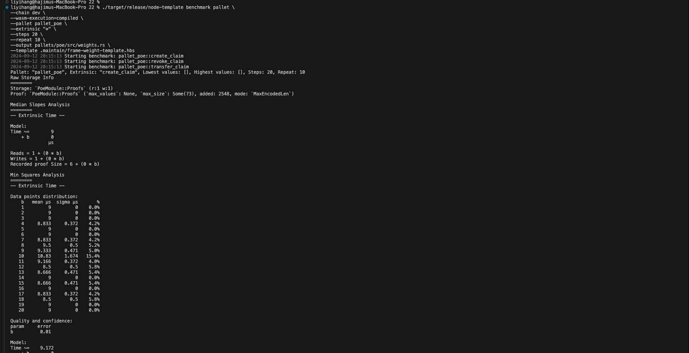

# Play Substrate

A few simple pallets for learning and demo the capability of Substrate blockchain framework.

## poe Benchmark



```

### Benchmark

Compile the node with `runtime-benchmarks` feature,
```shell
cargo build --profile=release --features runtime-benchmarks
```

Run the benchmark for Proof of Existence pallet,
```shell
./target/release/node-template benchmark pallet \
--chain dev \
--wasm-execution=compiled \
--pallet pallet_poe \
--extrinsic "*" \
--steps 20 \
--repeat 10 \
--output pallets/poe/src/weights.rs \
--template .maintain/frame-weight-template.hbs
```

Show all the available benchmarks,
```shell
./target/release/node-template benchmark pallet --chain dev --pallet "*" --extrinsic "*" --repeat 0
```
or
```
./target/release/node-template benchmark pallet --list

```