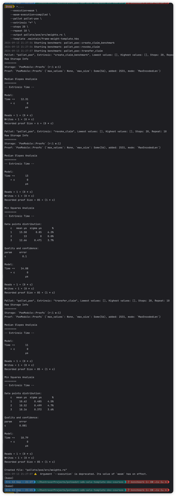

# 基准测试记录



# 命令
```shell
-- 基准测试编译
cargo build --profile=production --features runtime-benchmarks

-- 基准测试 生成文件

./target/production/solochain-template-node benchmark pallet \
    --chain dev \
    --execution=wasm \
    --wasm-execution=compiled \
    --pallet pallet-poe \
    --extrinsic "*" \
    --steps 20 \
    --repeat 10 \
    --output pallets/poe/src/weights.rs \
    --template .maintain/frame-weight-template.hbs 
    
```