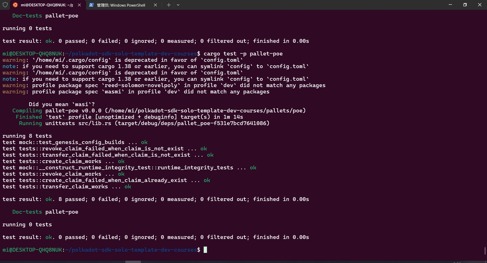
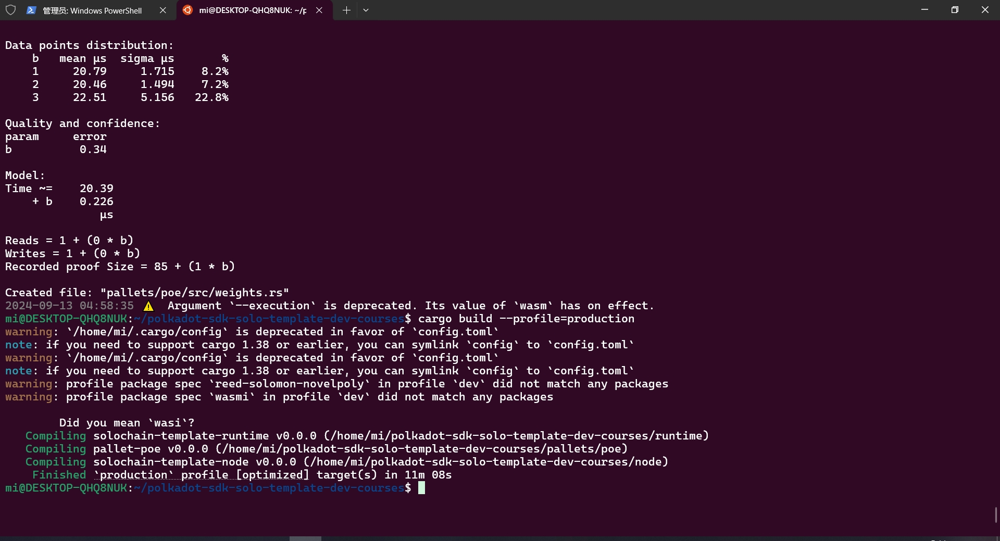

# Pallet-poe
***
## Test
存证模块的单元测试代码，包括：
- 创建存证的测试用例
- 撤销存证的测试用例
- 转移存证的测试用例

用下面的命令执行测试用例
```sh
cargo test -p pallet-poe
```

***
## Benchmark
总费用 = 基本费用 + 字节费用 + 权重费用*动态调节费率 + 小费
权重被用来定义交易产生的计算复杂度：
- 通过 Pays::No 来取消交易费用
- 权重纠正，可调用函数返回实际权重值
- WeightToFee 将权重值转换成费用
- 合理的权重值需要通过基准测试 benchmark 来获取

Benchmark 可调用函数
编译和运行：
```sh
cargo build --profile=production --features runtime-benchmarks
```
```sh
./target/production/solochain-template-node benchmark pallet \
 --chain dev \ 
 --execution=wasm \
 --wasm-execution=compiled \ 
 --pallet pallet_poe \ 
 --extrinsic "*" \ 
 --steps 20 \
 --repeat 10 \
 --output pallets/poe/src/weights.rs \
 --template .maintain/frame-weight-template.hbs
```

