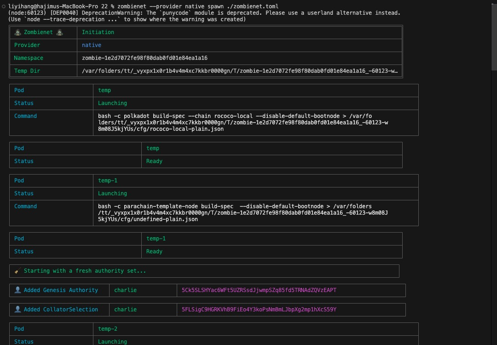
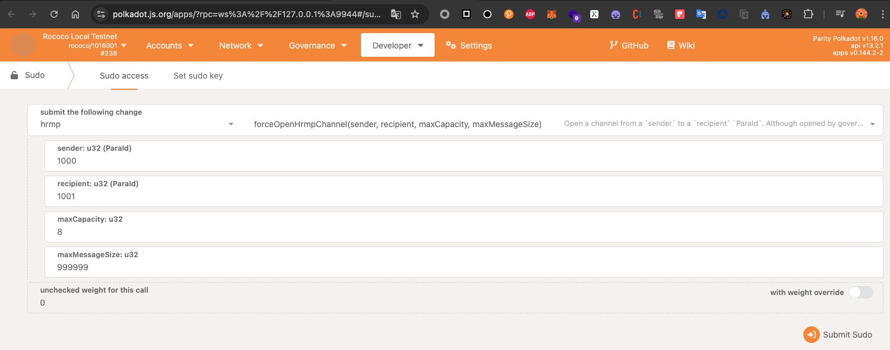
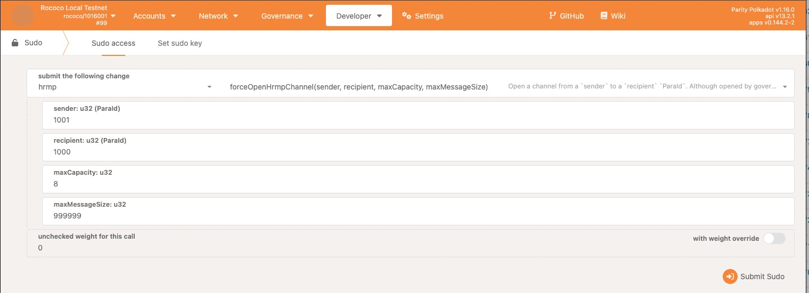
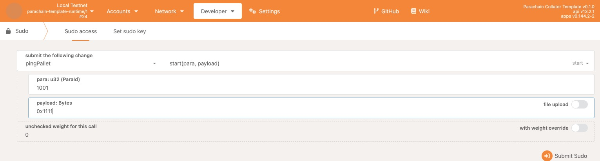
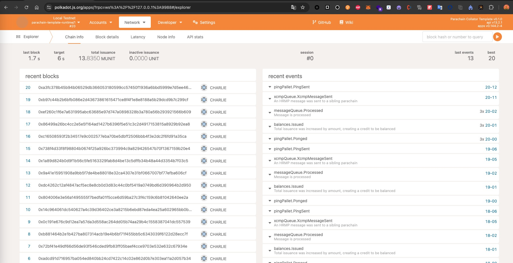
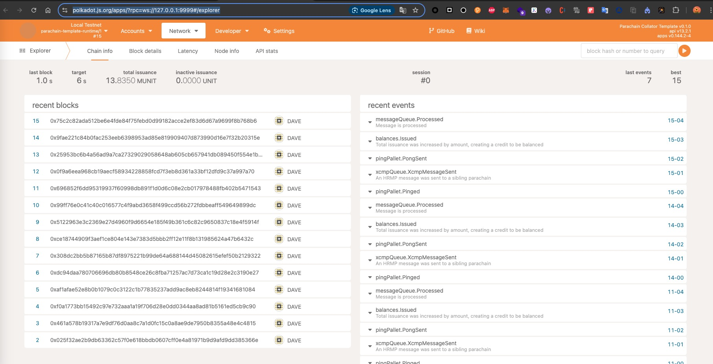

# install zombienet
cnpm i @zombienet/cli -g


# build parachain template
cargo build --package parachain-template-node --release


# get `polkadot`, `polkadot-prepare-worker`, `polkadot-execute-worker` bin from https://github.com/paritytech/polkadot-sdk/releases/latest

or 
get code to build https://github.com/paritytech/polkadot-sdk/tree/polkadot-v1.16.0
cargo build  --package polkadot --release
copy polkadot to parachain release dir


# run zombienet
export PATH="./target/release/:$PATH"
zombienet --provider native spawn ./zombienet.toml


```
$zombienet --provider native spawn ./zombienet.toml
(node:33122) [DEP0040] DeprecationWarning: The `punycode` module is deprecated. Please use a userland alternative instead.
(Use `node --trace-deprecation ...` to show where the warning was created)
╔════════════════════╤════════════════════════════════════════════════════════════════════════════════════════════════════╗
║ 🧟 Zombienet 🧟    │ Initiation                                                                                         ║
╟────────────────────┼────────────────────────────────────────────────────────────────────────────────────────────────────╢
║ Provider           │ native                                                                                             ║
╟────────────────────┼────────────────────────────────────────────────────────────────────────────────────────────────────╢
║ Namespace          │ zombie-1c9eed6969125863cd4ac25f5ad36fa9                                                            ║
╟────────────────────┼────────────────────────────────────────────────────────────────────────────────────────────────────╢
║ Temp Dir           │ /var/folders/tt/_vyxpx1x0r1b4v4m4xc7kkbr0000gn/T/zombie-1c9eed6969125863cd4ac25f5ad36fa9_-33122-e… ║
╚════════════════════╧════════════════════════════════════════════════════════════════════════════════════════════════════╝
┌─────────────────────────┬────────────────────────────────────────────────────────────────────────────────────────────────────┐
│ Pod                     │ temp                                                                                               │
├─────────────────────────┼────────────────────────────────────────────────────────────────────────────────────────────────────┤
│ Status                  │ Launching                                                                                          │
├─────────────────────────┼────────────────────────────────────────────────────────────────────────────────────────────────────┤
│ Command                 │ bash -c polkadot build-spec --chain rococo-local --disable-default-bootnode > /var/fo              │
│                         │ lders/tt/_vyxpx1x0r1b4v4m4xc7kkbr0000gn/T/zombie-1c9eed6969125863cd4ac25f5ad36fa9_-33122-e         │
│                         │ rsbWHUmu3vD/cfg/rococo-local-plain.json                                                            │
└─────────────────────────┴────────────────────────────────────────────────────────────────────────────────────────────────────┘
┌────────────────────────────────────────┬────────────────────────────────────────────────────────────────────────────────┐
│ Pod                                    │ temp                                                                           │
├────────────────────────────────────────┼────────────────────────────────────────────────────────────────────────────────┤
│ Status                                 │ Ready                                                                          │
└────────────────────────────────────────┴────────────────────────────────────────────────────────────────────────────────┘
┌─────────────────────────┬────────────────────────────────────────────────────────────────────────────────────────────────────┐
│ Pod                     │ temp-1                                                                                             │
├─────────────────────────┼────────────────────────────────────────────────────────────────────────────────────────────────────┤
│ Status                  │ Launching                                                                                          │
├─────────────────────────┼────────────────────────────────────────────────────────────────────────────────────────────────────┤
│ Command                 │ bash -c parachain-template-node build-spec  --disable-default-bootnode > /var/folders              │
│                         │ /tt/_vyxpx1x0r1b4v4m4xc7kkbr0000gn/T/zombie-1c9eed6969125863cd4ac25f5ad36fa9_-33122-ersbWH         │
│                         │ Umu3vD/cfg/undefined-plain.json                                                                    │
└─────────────────────────┴────────────────────────────────────────────────────────────────────────────────────────────────────┘
┌─────────────────────────┬────────────────────────────────────────────────────────────────────────────────────────────────────┐
│ Pod                     │ temp-2                                                                                             │
├─────────────────────────┼────────────────────────────────────────────────────────────────────────────────────────────────────┤
│ Status                  │ Launching                                                                                          │
├─────────────────────────┼────────────────────────────────────────────────────────────────────────────────────────────────────┤
│ Command                 │ bash -c parachain-template-node build-spec  --disable-default-bootnode > /var/folders              │
│                         │ /tt/_vyxpx1x0r1b4v4m4xc7kkbr0000gn/T/zombie-1c9eed6969125863cd4ac25f5ad36fa9_-33122-ersbWH         │
│                         │ Umu3vD/cfg/undefined-plain.json                                                                    │
└─────────────────────────┴────────────────────────────────────────────────────────────────────────────────────────────────────┘
┌────────────────────────────────────────┬────────────────────────────────────────────────────────────────────────────────┐
│ Pod                                    │ temp-1                                                                         │
├────────────────────────────────────────┼────────────────────────────────────────────────────────────────────────────────┤
│ Status                                 │ Ready                                                                          │
└────────────────────────────────────────┴────────────────────────────────────────────────────────────────────────────────┘
┌────────────────────────────────────────┬────────────────────────────────────────────────────────────────────────────────┐
│ Pod                                    │ temp-2                                                                         │
├────────────────────────────────────────┼────────────────────────────────────────────────────────────────────────────────┤
│ Status                                 │ Ready                                                                          │
└────────────────────────────────────────┴────────────────────────────────────────────────────────────────────────────────┘
┌────────────────────────────────────────────────────────────────────────────────────────────────────────────────────────┐
│ 🧹 Starting with a fresh authority set...                                                                              │
└────────────────────────────────────────────────────────────────────────────────────────────────────────────────────────┘
┌──────────────────────────────┬────────────────────┬──────────────────────────────────────────────────────────────────────┐
│ 👤 Added Genesis Authority   │ charlie            │ 5Ck5SLSHYac6WFt5UZRSsdJjwmpSZq85fd5TRNAdZQVzEAPT                     │
└──────────────────────────────┴────────────────────┴──────────────────────────────────────────────────────────────────────┘
┌──────────────────────────────┬────────────────────┬──────────────────────────────────────────────────────────────────────┐
│ 👤 Added CollatorSelection   │ charlie            │ 5FLSigC9HGRKVhB9FiEo4Y3koPsNmBmLJbpXg2mp1hXcS59Y                     │
└──────────────────────────────┴────────────────────┴──────────────────────────────────────────────────────────────────────┘
┌────────────────────────────────────────────────────────────────────────────────────────────────────────────────────────┐
│ 🧹 Starting with a fresh authority set...                                                                              │
└────────────────────────────────────────────────────────────────────────────────────────────────────────────────────────┘
┌──────────────────────────────┬────────────────────┬──────────────────────────────────────────────────────────────────────┐
│ 👤 Added Genesis Authority   │ dave               │ 5HKPmK9GYtE1PSLsS1qiYU9xQ9Si1NcEhdeCq9sw5bqu4ns8                     │
└──────────────────────────────┴────────────────────┴──────────────────────────────────────────────────────────────────────┘
┌──────────────────────────────┬────────────────────┬──────────────────────────────────────────────────────────────────────┐
│ 👤 Added CollatorSelection   │ dave               │ 5DAAnrj7VHTznn2AWBemMuyBwZWs6FNFjdyVXUeYum3PTXFy                     │
└──────────────────────────────┴────────────────────┴──────────────────────────────────────────────────────────────────────┘
┌─────────────────────────┬────────────────────────────────────────────────────────────────────────────────────────────────────┐
│ Pod                     │ temp-3                                                                                             │
├─────────────────────────┼────────────────────────────────────────────────────────────────────────────────────────────────────┤
│ Status                  │ Launching                                                                                          │
├─────────────────────────┼────────────────────────────────────────────────────────────────────────────────────────────────────┤
│ Command                 │ bash -c parachain-template-node build-spec  --disable-default-bootnode --chain /var/f              │
│                         │ olders/tt/_vyxpx1x0r1b4v4m4xc7kkbr0000gn/T/zombie-1c9eed6969125863cd4ac25f5ad36fa9_-33122-         │
│                         │ ersbWHUmu3vD/1000-rococo-local-plain.json  --raw > /var/folders/tt/_vyxpx1x0r1b4v4m4xc7kkb         │
│                         │ r0000gn/T/zombie-1c9eed6969125863cd4ac25f5ad36fa9_-33122-ersbWHUmu3vD/1000-rococo-local-ra         │
│                         │ w.json                                                                                             │
└─────────────────────────┴────────────────────────────────────────────────────────────────────────────────────────────────────┘
┌─────────────────────────┬────────────────────────────────────────────────────────────────────────────────────────────────────┐
│ Pod                     │ temp-4                                                                                             │
├─────────────────────────┼────────────────────────────────────────────────────────────────────────────────────────────────────┤
│ Status                  │ Launching                                                                                          │
├─────────────────────────┼────────────────────────────────────────────────────────────────────────────────────────────────────┤
│ Command                 │ bash -c parachain-template-node build-spec  --disable-default-bootnode --chain /var/f              │
│                         │ olders/tt/_vyxpx1x0r1b4v4m4xc7kkbr0000gn/T/zombie-1c9eed6969125863cd4ac25f5ad36fa9_-33122-         │
│                         │ ersbWHUmu3vD/1001-rococo-local-plain.json  --raw > /var/folders/tt/_vyxpx1x0r1b4v4m4xc7kkb         │
│                         │ r0000gn/T/zombie-1c9eed6969125863cd4ac25f5ad36fa9_-33122-ersbWHUmu3vD/1001-rococo-local-ra         │
│                         │ w.json                                                                                             │
└─────────────────────────┴────────────────────────────────────────────────────────────────────────────────────────────────────┘
┌────────────────────────────────────────┬────────────────────────────────────────────────────────────────────────────────┐
│ Pod                                    │ temp-3                                                                         │
├────────────────────────────────────────┼────────────────────────────────────────────────────────────────────────────────┤
│ Status                                 │ Ready                                                                          │
└────────────────────────────────────────┴────────────────────────────────────────────────────────────────────────────────┘
┌────────────────────────────────────────┬────────────────────────────────────────────────────────────────────────────────┐
│ Pod                                    │ temp-4                                                                         │
├────────────────────────────────────────┼────────────────────────────────────────────────────────────────────────────────┤
│ Status                                 │ Ready                                                                          │
└────────────────────────────────────────┴────────────────────────────────────────────────────────────────────────────────┘
┌─────────────────────────┬────────────────────────────────────────────────────────────────────────────────────────────────────┐
│ Pod                     │ temp-collator                                                                                      │
├─────────────────────────┼────────────────────────────────────────────────────────────────────────────────────────────────────┤
│ Status                  │ Launching                                                                                          │
├─────────────────────────┼────────────────────────────────────────────────────────────────────────────────────────────────────┤
│ Command                 │ bash -c parachain-template-node export-genesis-head -d /var/folders/tt/_vyxpx1x0r1b4v              │
│                         │ 4m4xc7kkbr0000gn/T/zombie-1c9eed6969125863cd4ac25f5ad36fa9_-33122-ersbWHUmu3vD/export-gene         │
│                         │ sis-state/1000 --chain /var/folders/tt/_vyxpx1x0r1b4v4m4xc7kkbr0000gn/T/zombie-1c9eed69691         │
│                         │ 25863cd4ac25f5ad36fa9_-33122-ersbWHUmu3vD/1000-rococo-local.json /var/folders/tt/_vyxpx1x0         │
│                         │ r1b4v4m4xc7kkbr0000gn/T/zombie-1c9eed6969125863cd4ac25f5ad36fa9_-33122-ersbWHUmu3vD/cfg/ge         │
│                         │ nesis-state-1000 && parachain-template-node export-genesis-wasm --chain /var/folders/tt/_v         │
│                         │ yxpx1x0r1b4v4m4xc7kkbr0000gn/T/zombie-1c9eed6969125863cd4ac25f5ad36fa9_-33122-ersbWHUmu3vD         │
│                         │ /1000-rococo-local.json /var/folders/tt/_vyxpx1x0r1b4v4m4xc7kkbr0000gn/T/zombie-1c9eed6969         │
│                         │ 125863cd4ac25f5ad36fa9_-33122-ersbWHUmu3vD/cfg/genesis-wasm-1000                                   │
└─────────────────────────┴────────────────────────────────────────────────────────────────────────────────────────────────────┘
┌─────────────────────────┬────────────────────────────────────────────────────────────────────────────────────────────────────┐
│ Pod                     │ temp-collator-1                                                                                    │
├─────────────────────────┼────────────────────────────────────────────────────────────────────────────────────────────────────┤
│ Status                  │ Launching                                                                                          │
├─────────────────────────┼────────────────────────────────────────────────────────────────────────────────────────────────────┤
│ Command                 │ bash -c parachain-template-node export-genesis-head -d /var/folders/tt/_vyxpx1x0r1b4v              │
│                         │ 4m4xc7kkbr0000gn/T/zombie-1c9eed6969125863cd4ac25f5ad36fa9_-33122-ersbWHUmu3vD/export-gene         │
│                         │ sis-state/1001 --chain /var/folders/tt/_vyxpx1x0r1b4v4m4xc7kkbr0000gn/T/zombie-1c9eed69691         │
│                         │ 25863cd4ac25f5ad36fa9_-33122-ersbWHUmu3vD/1001-rococo-local.json /var/folders/tt/_vyxpx1x0         │
│                         │ r1b4v4m4xc7kkbr0000gn/T/zombie-1c9eed6969125863cd4ac25f5ad36fa9_-33122-ersbWHUmu3vD/cfg/ge         │
│                         │ nesis-state-1001 && parachain-template-node export-genesis-wasm --chain /var/folders/tt/_v         │
│                         │ yxpx1x0r1b4v4m4xc7kkbr0000gn/T/zombie-1c9eed6969125863cd4ac25f5ad36fa9_-33122-ersbWHUmu3vD         │
│                         │ /1001-rococo-local.json /var/folders/tt/_vyxpx1x0r1b4v4m4xc7kkbr0000gn/T/zombie-1c9eed6969         │
│                         │ 125863cd4ac25f5ad36fa9_-33122-ersbWHUmu3vD/cfg/genesis-wasm-1001                                   │
└─────────────────────────┴────────────────────────────────────────────────────────────────────────────────────────────────────┘
┌────────────────────────────────────────┬────────────────────────────────────────────────────────────────────────────────┐
│ Pod                                    │ temp-collator-1                                                                │
├────────────────────────────────────────┼────────────────────────────────────────────────────────────────────────────────┤
│ Status                                 │ Ready                                                                          │
└────────────────────────────────────────┴────────────────────────────────────────────────────────────────────────────────┘
┌────────────────────────────────────────┬────────────────────────────────────────────────────────────────────────────────┐
│ Pod                                    │ temp-collator                                                                  │
├────────────────────────────────────────┼────────────────────────────────────────────────────────────────────────────────┤
│ Status                                 │ Ready                                                                          │
└────────────────────────────────────────┴────────────────────────────────────────────────────────────────────────────────┘
╔════════════════════════════════════════════════════════════════════════════════════════════════════════════════════════╗
║ ✓ Added Genesis Parachain 1000                                                                                         ║
╚════════════════════════════════════════════════════════════════════════════════════════════════════════════════════════╝
╔════════════════════════════════════════════════════════════════════════════════════════════════════════════════════════╗
║ ✓ Added Genesis Parachain 1001                                                                                         ║
╚════════════════════════════════════════════════════════════════════════════════════════════════════════════════════════╝
┌────────────────────────────────────────────────────────────────────────────────────────────────────────────────────────┐
│ 🧹 Starting with a fresh authority set...                                                                              │
└────────────────────────────────────────────────────────────────────────────────────────────────────────────────────────┘
╔════════════════════════════════════════════════════════════════════════════════════════════════════════════════════════╗
║ 👤 Added Balance 2000000000000 for alice - 5GNJqTPyNqANBkUVMN1LPPrxXnFouWXoe2wNSmmEoLctxiZY                            ║
╚════════════════════════════════════════════════════════════════════════════════════════════════════════════════════════╝
╔════════════════════════════════════════════════════════════════════════════════════════════════════════════════════════╗
║ 👤 Added Balance 2000000000000 for bob - 5HpG9w8EBLe5XCrbczpwq5TSXvedjrBGCwqxK1iQ7qUsSWFc                              ║
╚════════════════════════════════════════════════════════════════════════════════════════════════════════════════════════╝
┌──────────────────────────────┬────────────────────┬──────────────────────────────────────────────────────────────────────┐
│ 👤 Added Genesis Authority   │ alice              │ 5GNJqTPyNqANBkUVMN1LPPrxXnFouWXoe2wNSmmEoLctxiZY                     │
└──────────────────────────────┴────────────────────┴──────────────────────────────────────────────────────────────────────┘
┌──────────────────────────────┬────────────────────┬──────────────────────────────────────────────────────────────────────┐
│ 👤 Added Genesis Authority   │ bob                │ 5HpG9w8EBLe5XCrbczpwq5TSXvedjrBGCwqxK1iQ7qUsSWFc                     │
└──────────────────────────────┴────────────────────┴──────────────────────────────────────────────────────────────────────┘
┌─────────────────────────┬────────────────────────────────────────────────────────────────────────────────────────────────────┐
│ Pod                     │ temp-5                                                                                             │
├─────────────────────────┼────────────────────────────────────────────────────────────────────────────────────────────────────┤
│ Status                  │ Launching                                                                                          │
├─────────────────────────┼────────────────────────────────────────────────────────────────────────────────────────────────────┤
│ Command                 │ bash -c polkadot build-spec --chain /var/folders/tt/_vyxpx1x0r1b4v4m4xc7kkbr0000gn/T/              │
│                         │ zombie-1c9eed6969125863cd4ac25f5ad36fa9_-33122-ersbWHUmu3vD/rococo-local-plain.json --disa         │
│                         │ ble-default-bootnode  --raw > /var/folders/tt/_vyxpx1x0r1b4v4m4xc7kkbr0000gn/T/zombie-1c9e         │
│                         │ ed6969125863cd4ac25f5ad36fa9_-33122-ersbWHUmu3vD/rococo-local-raw.json                             │
└─────────────────────────┴────────────────────────────────────────────────────────────────────────────────────────────────────┘
┌────────────────────────────────────────┬────────────────────────────────────────────────────────────────────────────────┐
│ Pod                                    │ temp-5                                                                         │
├────────────────────────────────────────┼────────────────────────────────────────────────────────────────────────────────┤
│ Status                                 │ Ready                                                                          │
└────────────────────────────────────────┴────────────────────────────────────────────────────────────────────────────────┘
╔════════════════════════════════════════════════════════════════════════════════════════════════════════════════════════╗
║ Chain name: Rococo Local Testnet                                                                                       ║
╚════════════════════════════════════════════════════════════════════════════════════════════════════════════════════════╝
┌────────────────────────────────────────────────────────────────────────────────────────────────────────────────────────┐
│ Rococo Local Testnet ⚙ Clear Boot Nodes                                                                                │
└────────────────────────────────────────────────────────────────────────────────────────────────────────────────────────┘
┌─────────────────────────┬────────────────────────────────────────────────────────────────────────────────────────────────────┐
│ Pod                     │ alice                                                                                              │
├─────────────────────────┼────────────────────────────────────────────────────────────────────────────────────────────────────┤
│ Status                  │ Launching                                                                                          │
├─────────────────────────┼────────────────────────────────────────────────────────────────────────────────────────────────────┤
│ Command                 │ polkadot --chain /var/folders/tt/_vyxpx1x0r1b4v4m4xc7kkbr0000gn/T/zombie-1c9eed696912              │
│                         │ 5863cd4ac25f5ad36fa9_-33122-ersbWHUmu3vD/alice/cfg/rococo-local.json --name alice --rpc-co         │
│                         │ rs all --unsafe-rpc-external --rpc-methods unsafe --no-mdns --node-key 2bd806c97f0e00af1a1         │
│                         │ fc3328fa763a9269723c8db8fac4f93af71db186d6e90 --no-telemetry --prometheus-external --valid         │
│                         │ ator --insecure-validator-i-know-what-i-do --prometheus-port 58232 --rpc-port 9944 --liste         │
│                         │ n-addr /ip4/0.0.0.0/tcp/58230/ws --base-path /var/folders/tt/_vyxpx1x0r1b4v4m4xc7kkbr0000g         │
│                         │ n/T/zombie-1c9eed6969125863cd4ac25f5ad36fa9_-33122-ersbWHUmu3vD/alice/data                         │
└─────────────────────────┴────────────────────────────────────────────────────────────────────────────────────────────────────┘
┌────────────────────────────────────────┬────────────────────────────────────────────────────────────────────────────────┐
│ Pod                                    │ alice                                                                          │
├────────────────────────────────────────┼────────────────────────────────────────────────────────────────────────────────┤
│ Status                                 │ Ready                                                                          │
└────────────────────────────────────────┴────────────────────────────────────────────────────────────────────────────────┘
╔════════════════════╤════════════════════════════════════════════════════════════════════════════════════════════════════╗
║ Pod                │ alice                                                                                              ║
╟────────────────────┼────────────────────────────────────────────────────────────────────────────────────────────────────╢
║ Status             │ Running                                                                                            ║
╟────────────────────╧────────────────────────────────────────────────────────────────────────────────────────────────────╢
║ You can follow the logs of the node by running this command:                                                            ║
╚═════════════════════════════════════════════════════════════════════════════════════════════════════════════════════════╝
tail -f  /var/folders/tt/_vyxpx1x0r1b4v4m4xc7kkbr0000gn/T/zombie-1c9eed6969125863cd4ac25f5ad36fa9_-33122-ersbWHUmu3vD/alice.log


┌────────────────────────────────────────────────────────────────────────────────────────────────────────────────────────┐
│ Rococo Local Testnet ⚙ Added Boot Nodes                                                                                │
├────────────────────────────────────────────────────────────────────────────────────────────────────────────────────────┤
│ /ip4/127.0.0.1/tcp/58230/ws/p2p/12D3KooWQCkBm1BYtkHpocxCwMgR8yjitEeHGx8spzcDLGt2gkBm                                   │
└────────────────────────────────────────────────────────────────────────────────────────────────────────────────────────┘
┌─────────────────────────┬────────────────────────────────────────────────────────────────────────────────────────────────────┐
│ Pod                     │ bob                                                                                                │
├─────────────────────────┼────────────────────────────────────────────────────────────────────────────────────────────────────┤
│ Status                  │ Launching                                                                                          │
├─────────────────────────┼────────────────────────────────────────────────────────────────────────────────────────────────────┤
│ Command                 │ polkadot --chain /var/folders/tt/_vyxpx1x0r1b4v4m4xc7kkbr0000gn/T/zombie-1c9eed696912              │
│                         │ 5863cd4ac25f5ad36fa9_-33122-ersbWHUmu3vD/bob/cfg/rococo-local.json --name bob --rpc-cors a         │
│                         │ ll --unsafe-rpc-external --rpc-methods unsafe --no-mdns --node-key 81b637d8fcd2c6da6359e69         │
│                         │ 63113a1170de795e4b725b84d1e0b4cfd9ec58ce9 --no-telemetry --prometheus-external --validator         │
│                         │  --insecure-validator-i-know-what-i-do --bootnodes /ip4/127.0.0.1/tcp/58230/ws/p2p/12D3Koo         │
│                         │ WQCkBm1BYtkHpocxCwMgR8yjitEeHGx8spzcDLGt2gkBm --prometheus-port 58235 --rpc-port 9955 --li         │
│                         │ sten-addr /ip4/0.0.0.0/tcp/58233/ws --base-path /var/folders/tt/_vyxpx1x0r1b4v4m4xc7kkbr00         │
│                         │ 00gn/T/zombie-1c9eed6969125863cd4ac25f5ad36fa9_-33122-ersbWHUmu3vD/bob/data                        │
└─────────────────────────┴────────────────────────────────────────────────────────────────────────────────────────────────────┘
┌────────────────────────────────────────┬────────────────────────────────────────────────────────────────────────────────┐
│ Pod                                    │ bob                                                                            │
├────────────────────────────────────────┼────────────────────────────────────────────────────────────────────────────────┤
│ Status                                 │ Ready                                                                          │
└────────────────────────────────────────┴────────────────────────────────────────────────────────────────────────────────┘
╔════════════════════╤════════════════════════════════════════════════════════════════════════════════════════════════════╗
║ Pod                │ bob                                                                                                ║
╟────────────────────┼────────────────────────────────────────────────────────────────────────────────────────────────────╢
║ Status             │ Running                                                                                            ║
╟────────────────────╧────────────────────────────────────────────────────────────────────────────────────────────────────╢
║ You can follow the logs of the node by running this command:                                                            ║
╚═════════════════════════════════════════════════════════════════════════════════════════════════════════════════════════╝
tail -f  /var/folders/tt/_vyxpx1x0r1b4v4m4xc7kkbr0000gn/T/zombie-1c9eed6969125863cd4ac25f5ad36fa9_-33122-ersbWHUmu3vD/bob.log


╔════════════════════════════════════════════════════════════════════════════════════════════════════════════════════════╗
║ All relay chain nodes spawned...                                                                                       ║
╚════════════════════════════════════════════════════════════════════════════════════════════════════════════════════════╝
┌─────────────────────────┬────────────────────────────────────────────────────────────────────────────────────────────────────┐
│ Pod                     │ charlie                                                                                            │
├─────────────────────────┼────────────────────────────────────────────────────────────────────────────────────────────────────┤
│ Status                  │ Launching                                                                                          │
├─────────────────────────┼────────────────────────────────────────────────────────────────────────────────────────────────────┤
│ Command                 │ parachain-template-node --name charlie --node-key b9dd960c1753459a78115d3cb845a57d924              │
│                         │ b6877e805b08bd01086ccdf34433c --chain /var/folders/tt/_vyxpx1x0r1b4v4m4xc7kkbr0000gn/T/zom         │
│                         │ bie-1c9eed6969125863cd4ac25f5ad36fa9_-33122-ersbWHUmu3vD/charlie/cfg/rococo-local-1000.jso         │
│                         │ n --base-path /var/folders/tt/_vyxpx1x0r1b4v4m4xc7kkbr0000gn/T/zombie-1c9eed6969125863cd4a         │
│                         │ c25f5ad36fa9_-33122-ersbWHUmu3vD/charlie/data --listen-addr /ip4/0.0.0.0/tcp/58236/ws --pr         │
│                         │ ometheus-external --rpc-cors all --unsafe-rpc-external --rpc-methods unsafe --prometheus-p         │
│                         │ ort 58238 --rpc-port 9988 --collator -- --chain /var/folders/tt/_vyxpx1x0r1b4v4m4xc7kkbr00         │
│                         │ 00gn/T/zombie-1c9eed6969125863cd4ac25f5ad36fa9_-33122-ersbWHUmu3vD/charlie/cfg/rococo-loca         │
│                         │ l.json --execution wasm --port 58328 --rpc-port 58329                                              │
└─────────────────────────┴────────────────────────────────────────────────────────────────────────────────────────────────────┘
┌────────────────────────────────────────┬────────────────────────────────────────────────────────────────────────────────┐
│ Pod                                    │ charlie                                                                        │
├────────────────────────────────────────┼────────────────────────────────────────────────────────────────────────────────┤
│ Status                                 │ Ready                                                                          │
└────────────────────────────────────────┴────────────────────────────────────────────────────────────────────────────────┘
╔════════════════════╤════════════════════════════════════════════════════════════════════════════════════════════════════╗
║ Pod                │ charlie                                                                                            ║
╟────────────────────┼────────────────────────────────────────────────────────────────────────────────────────────────────╢
║ Status             │ Running                                                                                            ║
╟────────────────────╧────────────────────────────────────────────────────────────────────────────────────────────────────╢
║ You can follow the logs of the node by running this command:                                                            ║
╚═════════════════════════════════════════════════════════════════════════════════════════════════════════════════════════╝
tail -f  /var/folders/tt/_vyxpx1x0r1b4v4m4xc7kkbr0000gn/T/zombie-1c9eed6969125863cd4ac25f5ad36fa9_-33122-ersbWHUmu3vD/charlie.log


┌────────────────────────────────────────────────────────────────────────────────────────────────────────────────────────┐
│ Local Testnet ⚙ Added Boot Nodes                                                                                       │
├────────────────────────────────────────────────────────────────────────────────────────────────────────────────────────┤
│ /ip4/127.0.0.1/tcp/58236/ws/p2p/12D3KooWPKzmmE2uYgF3z13xjpbFTp63g9dZFag8pG6MgnpSLF4S                                   │
└────────────────────────────────────────────────────────────────────────────────────────────────────────────────────────┘
┌─────────────────────────┬────────────────────────────────────────────────────────────────────────────────────────────────────┐
│ Pod                     │ dave                                                                                               │
├─────────────────────────┼────────────────────────────────────────────────────────────────────────────────────────────────────┤
│ Status                  │ Launching                                                                                          │
├─────────────────────────┼────────────────────────────────────────────────────────────────────────────────────────────────────┤
│ Command                 │ parachain-template-node --name dave --node-key 61ea0803f8853523b777d414ace3130cd4d3f9              │
│                         │ 2de2cd7ff8695c337d79c2eeee --chain /var/folders/tt/_vyxpx1x0r1b4v4m4xc7kkbr0000gn/T/zombie         │
│                         │ -1c9eed6969125863cd4ac25f5ad36fa9_-33122-ersbWHUmu3vD/dave/cfg/rococo-local-1001.json --ba         │
│                         │ se-path /var/folders/tt/_vyxpx1x0r1b4v4m4xc7kkbr0000gn/T/zombie-1c9eed6969125863cd4ac25f5a         │
│                         │ d36fa9_-33122-ersbWHUmu3vD/dave/data --listen-addr /ip4/0.0.0.0/tcp/58239/ws --prometheus-         │
│                         │ external --rpc-cors all --unsafe-rpc-external --rpc-methods unsafe --prometheus-port 58241         │
│                         │  --rpc-port 9999 --collator -- --chain /var/folders/tt/_vyxpx1x0r1b4v4m4xc7kkbr0000gn/T/zo         │
│                         │ mbie-1c9eed6969125863cd4ac25f5ad36fa9_-33122-ersbWHUmu3vD/dave/cfg/rococo-local.json --exe         │
│                         │ cution wasm --port 58361 --rpc-port 58362                                                          │
└─────────────────────────┴────────────────────────────────────────────────────────────────────────────────────────────────────┘
┌────────────────────────────────────────┬────────────────────────────────────────────────────────────────────────────────┐
│ Pod                                    │ dave                                                                           │
├────────────────────────────────────────┼────────────────────────────────────────────────────────────────────────────────┤
│ Status                                 │ Ready                                                                          │
└────────────────────────────────────────┴────────────────────────────────────────────────────────────────────────────────┘
╔════════════════════╤════════════════════════════════════════════════════════════════════════════════════════════════════╗
║ Pod                │ dave                                                                                               ║
╟────────────────────┼────────────────────────────────────────────────────────────────────────────────────────────────────╢
║ Status             │ Running                                                                                            ║
╟────────────────────╧────────────────────────────────────────────────────────────────────────────────────────────────────╢
║ You can follow the logs of the node by running this command:                                                            ║
╚═════════════════════════════════════════════════════════════════════════════════════════════════════════════════════════╝
tail -f  /var/folders/tt/_vyxpx1x0r1b4v4m4xc7kkbr0000gn/T/zombie-1c9eed6969125863cd4ac25f5ad36fa9_-33122-ersbWHUmu3vD/dave.log


┌────────────────────────────────────────────────────────────────────────────────────────────────────────────────────────┐
│ Local Testnet ⚙ Added Boot Nodes                                                                                       │
├────────────────────────────────────────────────────────────────────────────────────────────────────────────────────────┤
│ /ip4/127.0.0.1/tcp/58239/ws/p2p/12D3KooWKM1HeSv61ryZwAiBTZnqmass5pYM48k9Z7obzhTbnphm                                   │
└────────────────────────────────────────────────────────────────────────────────────────────────────────────────────────┘
┌───────────────────────────────────────────────────────────────────────────────────────────────────────────────────────────────────┐
│                                                       Network launched 🚀🚀                                                       │
├──────────────────────────────┬────────────────────────────────────────────────────────────────────────────────────────────────────┤
│ Namespace                    │ zombie-1c9eed6969125863cd4ac25f5ad36fa9                                                            │
├──────────────────────────────┼────────────────────────────────────────────────────────────────────────────────────────────────────┤
│ Provider                     │ native                                                                                             │
├──────────────────────────────┴────────────────────────────────────────────────────────────────────────────────────────────────────┤
│                                                         Node Information                                                          │
├──────────────────────────────┬────────────────────────────────────────────────────────────────────────────────────────────────────┤
│ Name                         │ alice                                                                                              │
├──────────────────────────────┼────────────────────────────────────────────────────────────────────────────────────────────────────┤
│ Direct Link                  │ https://polkadot.js.org/apps/?rpc=ws://127.0.0.1:9944#/explorer                                    │
├──────────────────────────────┼────────────────────────────────────────────────────────────────────────────────────────────────────┤
│ Prometheus Link              │ http://127.0.0.1:58232/metrics                                                                     │
├──────────────────────────────┼────────────────────────────────────────────────────────────────────────────────────────────────────┤
│ Log Cmd                      │ tail -f                                                                                            │
│                              │ /var/folders/tt/_vyxpx1x0r1b4v4m4xc7kkbr0000gn/T/zombie-1c9eed6969125863cd4ac25f5ad36fa9_-33122-e… │
├──────────────────────────────┴────────────────────────────────────────────────────────────────────────────────────────────────────┤
│                                                         Node Information                                                          │
├──────────────────────────────┬────────────────────────────────────────────────────────────────────────────────────────────────────┤
│ Name                         │ bob                                                                                                │
├──────────────────────────────┼────────────────────────────────────────────────────────────────────────────────────────────────────┤
│ Direct Link                  │ https://polkadot.js.org/apps/?rpc=ws://127.0.0.1:9955#/explorer                                    │
├──────────────────────────────┼────────────────────────────────────────────────────────────────────────────────────────────────────┤
│ Prometheus Link              │ http://127.0.0.1:58235/metrics                                                                     │
├──────────────────────────────┼────────────────────────────────────────────────────────────────────────────────────────────────────┤
│ Log Cmd                      │ tail -f                                                                                            │
│                              │ /var/folders/tt/_vyxpx1x0r1b4v4m4xc7kkbr0000gn/T/zombie-1c9eed6969125863cd4ac25f5ad36fa9_-33122-e… │
├──────────────────────────────┴────────────────────────────────────────────────────────────────────────────────────────────────────┤
│                                                         Node Information                                                          │
├──────────────────────────────┬────────────────────────────────────────────────────────────────────────────────────────────────────┤
│ Name                         │ charlie                                                                                            │
├──────────────────────────────┼────────────────────────────────────────────────────────────────────────────────────────────────────┤
│ Direct Link                  │ https://polkadot.js.org/apps/?rpc=ws://127.0.0.1:9988#/explorer                                    │
├──────────────────────────────┼────────────────────────────────────────────────────────────────────────────────────────────────────┤
│ Prometheus Link              │ http://127.0.0.1:58238/metrics                                                                     │
├──────────────────────────────┼────────────────────────────────────────────────────────────────────────────────────────────────────┤
│ Log Cmd                      │ tail -f                                                                                            │
│                              │ /var/folders/tt/_vyxpx1x0r1b4v4m4xc7kkbr0000gn/T/zombie-1c9eed6969125863cd4ac25f5ad36fa9_-33122-e… │
├──────────────────────────────┼────────────────────────────────────────────────────────────────────────────────────────────────────┤
│ Parachain ID                 │ 1000                                                                                               │
├──────────────────────────────┼────────────────────────────────────────────────────────────────────────────────────────────────────┤
│ ChainSpec Path               │ /var/folders/tt/_vyxpx1x0r1b4v4m4xc7kkbr0000gn/T/zombie-1c9eed6969125863cd4ac25f5ad36fa9_-33122-e… │
├──────────────────────────────┴────────────────────────────────────────────────────────────────────────────────────────────────────┤
│                                                         Node Information                                                          │
├──────────────────────────────┬────────────────────────────────────────────────────────────────────────────────────────────────────┤
│ Name                         │ dave                                                                                               │
├──────────────────────────────┼────────────────────────────────────────────────────────────────────────────────────────────────────┤
│ Direct Link                  │ https://polkadot.js.org/apps/?rpc=ws://127.0.0.1:9999#/explorer                                    │
├──────────────────────────────┼────────────────────────────────────────────────────────────────────────────────────────────────────┤
│ Prometheus Link              │ http://127.0.0.1:58241/metrics                                                                     │
├──────────────────────────────┼────────────────────────────────────────────────────────────────────────────────────────────────────┤
│ Log Cmd                      │ tail -f                                                                                            │
│                              │ /var/folders/tt/_vyxpx1x0r1b4v4m4xc7kkbr0000gn/T/zombie-1c9eed6969125863cd4ac25f5ad36fa9_-33122-e… │
├──────────────────────────────┼────────────────────────────────────────────────────────────────────────────────────────────────────┤
│ Parachain ID                 │ 1001                                                                                               │
├──────────────────────────────┼────────────────────────────────────────────────────────────────────────────────────────────────────┤
│ ChainSpec Path               │ /var/folders/tt/_vyxpx1x0r1b4v4m4xc7kkbr0000gn/T/zombie-1c9eed6969125863cd4ac25f5ad36fa9_-33122-e… │
└──────────────────────────────┴────────────────────────────────────────────────────────────────────────────────────────────────────┘
```

# create hrmp channel
https://polkadot.js.org/apps/?rpc=ws%3A%2F%2F127.0.0.1%3A9944#/sudo

https://polkadot.js.org/apps/?rpc=ws%3A%2F%2F127.0.0.1%3A9944#/sudo


# send ping message
https://polkadot.js.org/apps/?rpc=ws%3A%2F%2F127.0.0.1%3A9988#/sudo


# check xcmp event
https://polkadot.js.org/apps/?rpc=ws%3A%2F%2F127.0.0.1%3A9988#/explorer



https://polkadot.js.org/apps/?rpc=ws://127.0.0.1:9999#/explorer


<div align="center">

# Polkadot SDK's Parachain Template


> This is a template for creating a [parachain](https://wiki.polkadot.network/docs/learn-parachains) based on Polkadot SDK.
>
> This template is automatically updated after releases in the main [Polkadot SDK monorepo](https://github.com/paritytech/polkadot-sdk).

</div>

* ⏫ This template provides a starting point to build a [parachain](https://wiki.polkadot.network/docs/learn-parachains).

* ☁️ It is based on the
[Cumulus](https://paritytech.github.io/polkadot-sdk/master/polkadot_sdk_docs/polkadot_sdk/cumulus/index.html) framework.

* 🔧 Its runtime is configured with a single custom pallet as a starting point, and a handful of ready-made pallets
such as a [Balances pallet](https://paritytech.github.io/polkadot-sdk/master/pallet_balances/index.html).

* 👉 Learn more about parachains [here](https://wiki.polkadot.network/docs/learn-parachains)

## Template Structure

A Polkadot SDK based project such as this one consists of:

* 💿 a [Node](./node/README.md) - the binary application.
* 🧮 the [Runtime](./runtime/README.md) - the core logic of the parachain.
* 🎨 the [Pallets](./pallets/README.md) - from which the runtime is constructed.

## Getting Started

* 🦀 The template is using the Rust language.

* 👉 Check the
[Rust installation instructions](https://www.rust-lang.org/tools/install) for your system.

* 🛠️ Depending on your operating system and Rust version, there might be additional
packages required to compile this template - please take note of the Rust compiler output.

### Build

🔨 Use the following command to build the node without launching it:

```sh
cargo build --package parachain-template-node --release
```

🐳 Alternatively, build the docker image:

```sh
docker build . -t polkadot-sdk-parachain-template
```

### Local Development Chain

🧟 This project uses [Zombienet](https://github.com/paritytech/zombienet) to orchestrate the relaychain and parachain nodes.
You can grab a [released binary](https://github.com/paritytech/zombienet/releases/latest) or use an [npm version](https://www.npmjs.com/package/@zombienet/cli).

This template produces a parachain node.
You still need a relaychain node - you can download the `polkadot`
(and the accompanying `polkadot-prepare-worker` and `polkadot-execute-worker`)
binaries from [Polkadot SDK releases](https://github.com/paritytech/polkadot-sdk/releases/latest).

Make sure to bring the parachain node - as well as `polkadot`, `polkadot-prepare-worker`, `polkadot-execute-worker`,
and `zombienet` - into `PATH` like so:

```sh
export PATH="./target/release/:$PATH"
```

This way, we can conveniently use them in the following steps.

👥 The following command starts a local development chain, with a single relay chain node and a single parachain collator:

```sh
zombienet --provider native spawn ./zombienet.toml

# Alternatively, the npm version:
npx --yes @zombienet/cli --provider native spawn ./zombienet.toml
```

Development chains:

* 🧹 Do not persist the state.
* 💰 Are preconfigured with a genesis state that includes several prefunded development accounts.
* 🧑‍⚖️ Development accounts are used as validators, collators, and `sudo` accounts.

### Connect with the Polkadot-JS Apps Front-End

* 🌐 You can interact with your local node using the
hosted version of the Polkadot/Substrate Portal:
[relay chain](https://polkadot.js.org/apps/#/explorer?rpc=ws://localhost:9944)
and [parachain](https://polkadot.js.org/apps/#/explorer?rpc=ws://localhost:9988).

* 🪐 A hosted version is also
available on [IPFS](https://dotapps.io/).

* 🧑‍🔧 You can also find the source code and instructions for hosting your own instance in the
[`polkadot-js/apps`](https://github.com/polkadot-js/apps) repository.

## Contributing

* 🔄 This template is automatically updated after releases in the main [Polkadot SDK monorepo](https://github.com/paritytech/polkadot-sdk).

* ➡️ Any pull requests should be directed to this [source](https://github.com/paritytech/polkadot-sdk/tree/master/templates/parachain).

* 😇 Please refer to the monorepo's
[contribution guidelines](https://github.com/paritytech/polkadot-sdk/blob/master/docs/contributor/CONTRIBUTING.md) and
[Code of Conduct](https://github.com/paritytech/polkadot-sdk/blob/master/docs/contributor/CODE_OF_CONDUCT.md).

## Getting Help

* 🧑‍🏫 To learn about Polkadot in general, [Polkadot.network](https://polkadot.network/) website is a good starting point.

* 🧑‍🔧 For technical introduction, [here](https://github.com/paritytech/polkadot-sdk#-documentation) are
the Polkadot SDK documentation resources.

* 👥 Additionally, there are [GitHub issues](https://github.com/paritytech/polkadot-sdk/issues) and
[Substrate StackExchange](https://substrate.stackexchange.com/).
